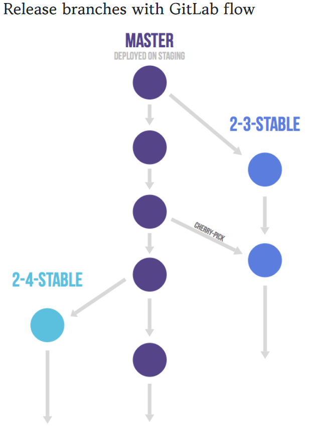

# Git과 GitHub

Git이란 __VCS(Version Control System)__에 대해서 기본적인 이해를 요구함. 전략들에 대한 이해를 기반으로 Git에서 사용하기 때문에 주로 사용되는 strategy 중심으로 공부하자!

### Git flow  vs  GitHub flow  vs  GitLab flow

- Git Flow

  - 기본 브런치는 5가지를 이야기한다.

     __feature > develop > release > hotfix > master__ 브런치가 존재하며, 머지 순서는 앞에서 뒤로 진행됨.  __release__ 브런치와 __hotfix__ 브런치 경우, __develop__ 브런치의 오른쪽에 존재하기에 모두 develop 브런치도 머지를 하도록 구성이 되어있음. 

    

  - 구조와 흐름
    - 가장 중심이 되는 브런치는 __master__랑 __develop__ 브런치이며, 이 두 개 브런치는 무조건 있어야 한다. 이름은 바뀔 수 있다만 웬만해서는 변경하지 않고 진행하도록 하자. Git도 Production에서 사용하는 브런치는 master를 사용하게 되니 관련된 부분을 변경하면 새로운 사람이 왔을때 스터디 커브가 존재할 수 있다. 
  - Feature 브런치
    - 브런치 나오는 곳 : develop
    - 브런치가 들어가는 곳 : develop
    - 이름 지정: master, develop, release-*, hotfix-* 를 제외한 어떤 것이든 가능
    - 새로운 기능을 추가하는 브런치로 feature 브런치는 origin 에는 반영하지않고, 개발자의 reop에만 존재하도록 한다. 여기서 머지를 할 때 , --no-ff 옵션을 이용하여 브런치에서 머지가 되었음을 git 기록에 남겨두도록 한다.
  - Release 브런치
    - 브런치 나오는 곳 : develop
    - 브런치가 들어가는 곳 : develop, master
    - 이름 지정 : release-*
    - 새로운 Production 릴리즈를 위한 브런치이다. 지금까지 한 기능을 묶어 develop 브런치에서 release 브런치를 따내고, develop 브런치에서는 다음번 릴리즈에서 사용할 기능을 추가함. release 브런치에서는 버그 픽스에 대한 부분만 커밋하고, 릴리즈가 준비되었다고 생각하면 master로 머지를 진행함. master로 머지 후 tag 명령을 이용하여 릴리즈 버전에 대해 명시를 하고 머지한 사람의 정보를 남긴다. 그 후 develop 브런치로 머지하여, release 브런치에서 수정된 내용이 develop 브런치에 반영한다.
  - Hotfix 브런치
    - 브런치 나오는 곳 : master
    - 브런치가 들어가는 곳 : develop, master
    - 이름 지정 : hotfix-*
    - Production에서 발생한 버그들은 전부 여기로온다... 수정이 끝나면 develop, master 브런치에 반영하고, master에는 tag를 추가해줌. 만약 release 브런치가 존재하면, release 브런치에 hotfix 브런치를 머지하여 릴리즈 될 때 반영될 수 있도록 한다.
  - 장점
    - 명령어가 나와있음
    - 웬많나 에디터와 IDE에는 플러그인으로 존재한다.
  - 단점
    - 브런치가 많아 복잡하다
    - 안 쓰는 브런치가 있고 애매한 브런치는 포지션이 애매하다.
  - Reference
    - [A successful Git branching model - Vincent Driessen](https://nvie.com/posts/a-successful-git-branching-model/)
    - [git-flow cheatsheet](https://danielkummer.github.io/git-flow-cheatsheet/index.ko_KR.html)
    - [nvie/gitflw](https://github.com/nvie/gitflow)
    - [gifflow, 쉬운 git brunch 관리 - 개발왕 김코딩](http://huns.me/development/1131)
    - [git 브랜칭 전략과 git flow - 꿀벌개발일지](https://ohgyun.com/402)

- GitHub Flow

  - Git Flow가 좋은 방식이긴 하지만 GitHub에선 사용하기가 복잡하다 여겨 __GitHub Flow__ 라는 내용으로 사용을 하고 있다고 한다. 그리고 __자동화__의 개념이 들어가 있다는점!! 자동화가 안되어있는 곳에는 수동으로 관련 작업을 진행하면 된다.

  - 흐름이 단순한 만큼 룰도 단순하다. master 브런치에 대한 role만 정확하다면 나머지 브런치들에는 관여를 하지 않는다. 그리고 __pull request__기능을 사용하도록 권장한다.

    

  - 특징
    - release 브런치가 명확하지 않은 시스템에서 사용에 맞게 되어있음.
    - GitHub 서비스 특성상 릴리즈라는 개념이 없는 서비스를 진행하고 있어서 그런 것으로 보이며, 웹 서비스들이 릴리즈라는 개념이 없어지고 있으니 사용하기 편할 것으로 보임
    - hotfix와 가장 작은 기능을 구분하지 않는다.
  - 어떻게 사용할 것인가?
    1. master 브런치는 어떤 때든 배포가 가능하다.
       - master 브런치는 항상 최신의 상태. stable 상태로 Product에 배포되는 브런치로 엄격한 role을 주어 사용한다.
    2. 새로운 일을 시작하기 위해 브런치를 master에서 딴다면 이름은 어떤 일을 하는지 명확하게 작성한다.
       - git flow와 다르게 feature 브런치나 develop 브런치가 존재하지않음
       - 그렇기에 새로운 기능을 추가하거나 버그를 해결하기 위한 브런치의 이름은 자세하게 어떤 일을 하는지 작성!
    3. 원격지 브런치로 수시로 push를 한다.
       - git flow와 가장 상반되는 방식으로 항상 원격지에 자신이 하고 있는 일들을 올려 다른 사람들도 확인할 수 잇도록 해줌.
       - 하드웨어에 문제가 발생하여 작업하던 부분이 없어지더라고 원격지에 소스를 받아 작업할 수 있도록 해주는 장점이 있다.
    4. 피드백이나 도움이 필요할 때, 그리고 머징 준비가 완료되었을 때는 pull request를 생성한다.
       -  pull request 는 코드 리뷰를 도와주는 시스템으로 이것을 이용하여 자신의 코드를 공유하고 리뷰를 받을 수 있도록 한다.
    5. 기능에 대한 리뷰와 사인이 끝난 후 master로 머지한다.
       - 곧장 product로 반영이 될 기능이기에 이해관계가 연결된 사람들과 충분히 논의 이후 반영하도록함
    6. master로 머지되고 푸시되었을 때는 즉시 배포되어야 한다.
       - GitHub Flow의 핵심인듯한 master로 머지가 일어나면 hubot을 이용하여 자동으로 배포되도록 설정해놓는다.

  - 장점
    - 브런치 전략이 단순함
    - 처음 git을 접하는 사람에게 좋은 시스템
    - Github 사이트에서 제공하는 기능을 모두 사용하여 작업을 진행
    - 코드 리뷰를 자연스럽게 사용할 수 있음
    - CI가 필수적이며, 배포는 자동으로 진행가능 (CI => 지속적 통합)
    - Github가 작업할 때 이렇게 작업중..!
  - 단점
    - CI와 배포 자동화가 되어있지 않은 시스템에서 사람이 관련된 업무를 진행함
    - 많은 것들이 올라오기 시작하면 ....지옥이 시작
  - Reference
    - [GitHub Flow](https://scottchacon.com/2011/08/31/github-flow.html)
    - [Understanding the GitHub Flow](https://guides.github.com/introduction/flow/)
    - [GitHub Flow - dogfeet](https://dogfeet.github.io/articles/2011/github-flow.html)
    - [Git Flow vs Github Flow](https://lucamezzalira.com/2014/03/10/git-flow-vs-github-flow/)
    - [GitHub Flow in teh Browser](https://github.com/blog/1557-github-flow-in-the-browser)

- GitLab Flow

  - Github에서 말하는 flow는 너무 간단하여 배포, 환경 구성, 릴리즈, 통합에 대한 이슈를 남겨둔 것이 많았음. 그것을 보안하기 위해 GitLab에서 관련 내용들을 추가적으로 덧붙여 설명한 것을 일컫음.

    

  - production 브런치가 존재하여 커밋한 내용들을 일방적으로 디플로이를 하는 형태로 GitHub에서 브런치 하나를 더 구성하여 사용하는 이것도 조금은 간단한 구성임.			

  - master와 production 사이에 pre-production을 두어 개발한 내용을 곧장 반영하지 않고 시간을 두고 반영을 하는 것을 말한다. Staging을 위한 공간을 만드는 거...

    

  - release한 브런치를 두고서 보안상 문제가 발생한 것이나 백 포트를 위해 작업을 할 경우, cherry-pick을 이용해서 작업을 진행할 수도 있다. 아니면 해당 릴리즈에서 발생하는 버그들을 묶어서 수정하는 방식으로 작업. 일반적으로 'upstream first' 정책이다.

  - Merge / pull requests with GitLab flow

    - Pull request 를 사용하는 방법이다. GitHub Flow에서 하는 방법과 동일

  - Issues with GitLab flow

    - Issue 트러커와 연결하여 사용하는 것을 말함. 긴 시간 작업을 할 경우, 이슈를 생성하여 작업을 진행하는 것.
    - 브런치 이름에 이슈번호를 적어 명확하게 해주는것이 필요함!
    - 작업이 끝나거나 코드 공유가 필요한 시점이면 Merge / pull requests를 보냄

  - Reference

    - [GitLab Flow](https://about.gitlab.com/2014/09/29/gitlab-flow/)
    - [GitLab flowから学ぶワークフローの実践](https://postd.cc/gitlab-flow/)
    - [GitLab Document](https://doc.gitlab.com/ee/workflow/gitlab_flow.html)
    - [アプリ開発にはGitlab flowが合うと思います](http://shoma2da.hatenablog.com/entry/2015/11/04/233534)

### GitHub

- 몇 가지 용어 정리
  - 메인 저장소(Main repository) : 오픈소스 프로젝트의 github 상의 메인 repository를 의미. 즉, 내가 기여하고 싶은 프로젝트의 저장소이므로 나에게는 쓰기 권한이 없다. 주로 upstream 이라고 부름!
  - 나의 저장소(My github reposetory) : github상에서 나의 계정상에 존재하는 repository로 메인 저장소로부터 fork한 저장소. 일반적으로 origin 이라고 부름!
  - 로컬 저장소(Local git repository) : 나의 컴퓨터상에 생성한 로컬 git repository를 의미함!
  - 작업 공간(workspace) : 나의 컴퓨터상에서 실제 내가 소스를 개발하고 수정하는 workspace를 의미함!

- 오픈소스 기여를 위한 GitHub 과정
  - 오픈소스 프로젝트 가져오기 : Fork를 통해 해당 프로젝트를 나의 Github 저장소로 불러와서 로컬 저장소에 복제하여 개발환경을 조성
  - 메인소 저장소와 동기와(SYNCHRONIZE) 유지 : remote를 통해 동기화를 유지하는데 git에서 remote라는 것은 원격저장소(github)상의 특정 위치를 바라보는 참조(reference) 라고 설명할 수 있음.
  - 컨트리뷰트 하기 : 몯느 준비가 완료되면 코드의내용은 각자의 몫이고 특정 소스가 수정이 되었다면 commit후 push를 한다. github 저장소 우측의 Pull Request 라는 버튼을 통해 메인 저장소의 주인에게 나의 변경점을 가져가달라고 요청하는 것이다. 주인이 수용하게 된다면 컨트리뷰터로 이름이 오르게된다.