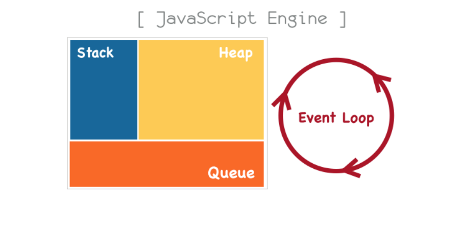

# JavaScript Event Loop

#### Javascript Engine



- javascript로 작성한 코드를 해석하고 실행하는 __인터프리터__이다.

- Call Stack, Task Queue(Event queue), Heap, Event loop

  - Call Stack :  자바스크립트는 __단 하나의 호출스택(call stack)__을 사용한다. 이는 하나의 함수가 실행되면 이 함수의 실행이 끝날 때까지 다른 어떤 task도 수행될 수 없다는 의미이다. 요청이 들어올 때마다 해당 요청을 __순차적__으로 호출 스택에 담아 처리한다. 메소드가 실행될 때, Call Stack에 새로운 프렝미이 생기고 __push__되고 메소드의 싫애이 끝나면 해당 프레임은 __pop__되는 원리이다. 

  - Heap : 동적으로 생성된 객체(인스턴스)는 힙에 할당됨. 대부분 구조화되지 않은 '더미'같은 메모리 영역을 'heap'이라 표현한다.

  - Task Queue(Event Queue) : 자바스크립트의 런타임환경에서는 처리해야 하는 Task들을 임시 젖아한느 대기 큐가 존재한다. 그 대기 큐를 __Task Queue__ or  __Event Queue__ 라고 한다. 그리고 Call Stack이 __비워졌을 때__ 먼저 대기열에 들어온 순서대로 수행됨.

    ```javascript
    setTimeout(function() {
        console.log("first");
    }, 0);
    console.log("second")
    
    //console >> 
    //second
    //first
    ```

    비동기로 호출되는 함수들은 Call Stack에 쌓이지 않고 __Task Queue__에 __enqueue__된다. 자바스크립트에선 이벤트에 의해 실행되는 함수들이 비동기로 실행된다. __Web API영역__에 따로 정의되어 있는 함수들은 비동기로 실행된다.

    ```javascript
    function test1() {
        console.log("test1")
        test2();
    }
    
    function test2() {
        let timer = setTimeout(function () {
            console.log("test2");
        },0);
        test3();
    }
    
    function test3(){
        console.log("test3")
    }
    
    test1();
    
    //console >> 
    //test1
    //test3
    //test2
    ```

    ```javascript
    while (queue.waitForMessage()){
        queue.processNextMessage();
    }
    ```


#### Hoisting

`hoist`라는 단어의 사전적 정의는 끌어올리기 라는 뜻이다. 자바스크립트에선 변수가 끌어올려진다. `var` keyword 로 선언된 모든 변수 선언은 __호이스트__ 된다. 

호이스트란 변수의 정의가 그 범위에 따라 `선언` 과 `할당` 으로 분리되는 것을 의미한다. 즉, 변수가 함수 내에서 정의되었을 경우, 선언이 함수의 최상위로, 함수 바깥에서 정의되었을 경우, 전역 컨텐스트의 최상위로변경이 된다.

- 선언 (Declaration) 과 할당(Assignment)

  - 끌어 올려지는것은 선언이다.

  ```javascript
  function getX() {
      console.log(x); // undefined
      var x = 100;
      console.log(x); // 100
  }
  getX();
  ```

  다른 언어의 경우엔, 변수 x를 선언하지 않고 출력하려하면 오류가 발생함. 하지만 자바스크립트에선 `undefined`라고 넘어간다. `var x = 100;`이 구문에서 `var x;`를 호이스트 하기 때문이다. 작동 순서에 맞게 코드를 재구성하면 다음과 같다

  ```javascript
  function getX(){
      var x;
      console.log(x);
      x = 100;
      console.log(x);
  }
  getX();
  ```

  선언문은 항시 자바스크립트 엔진 구동시 가장 __최우선__적으로 해석하므로 호이스팅되고, __할당 구문은 런타임 과정에서 이루어지기 때문에__ 호이스팅 되지 않는다.

  ```javascript
  foo();
  function foo() {
      console.log('hello');
  };
  // console > hello
  ```

  foo 함수에 대한 선언을 호이스팅하여 global 객체에 등록시키기 때문에 `hello`가 제대로 출력됨

  ```javascript
  foo( );
  var foo = function( ) {
    console.log(‘hello’);
  };
  // console> Uncaught TypeError: foo is not a function
  ```

  함수 리터럴을 할당하는 구조이기 때문에 호이스팅 되지 않으며 그렇기 때문에 런타임 환경에서 `Type Error`를 발생시킨다.


#### Closure

Closure(클로저) 란 __두 개의 함수로 만들어진 환경__ 으로 이루어진 특별한 객체의 한 종류이다. 여기서 __환경__ 이라 함은 클로저가 생성될 때 그 __범위__에 있던 여러 지역 변수들이 포함된 __context__를 말한다. 이 클로저를 통해서 자바스크립트에는 없는 비공개(private) 속성/메소스, 공개 속성/메소드를 구현할 수 있는 방안을 마련할 수 있다.

다음은 클로저가 생성되는 조건이다.

1. 내부 함수가 익명 함수로 되어 외부 함수의 반환값으로 사용된다.
2. 내부 함수는 외부 함수의 실행 환경(execution environment)에서 실행된다.
3. 내부 함수에서 사용되는 변수 x는 외부 함수의 변수 스코프에 있다.

```javascript
function outer() {
    var name = `closure`;
    function inner() {
        console.log(name);
    }
    inner();
}
outer();
// console > closure
```

`outer`함수를 실행시키는 `context`에는 `name`이라는 변수가 존재하지 않는다는 것을 확인할 수 있다. 비슷한 맥락으로 다음과 같이 변경해 볼 수 있다.

```javascript
var name = `Warning`;
function outer() {
    var name = `closure`;
    return function inner() {
        console.log(name);
    };
}

car callFunc = outer();
callFunc();
// console > closure
```

위 코드에서 `callFunc`를 클로저라고 한다. `callFunc` 호출에 의해 `name` 이라는 값이 console에 찍히는데, 찍히는 값은 `Warning`이 아니라 `closure` 라는 값이다. 즉, `outer` 함수의 context에 속해있는 변수를 참조하는 것이다. 여기서 `outer` 함수의 지역변수로 존재하는 `name`변수를 `free variable(자유변수)`라고 한다.


