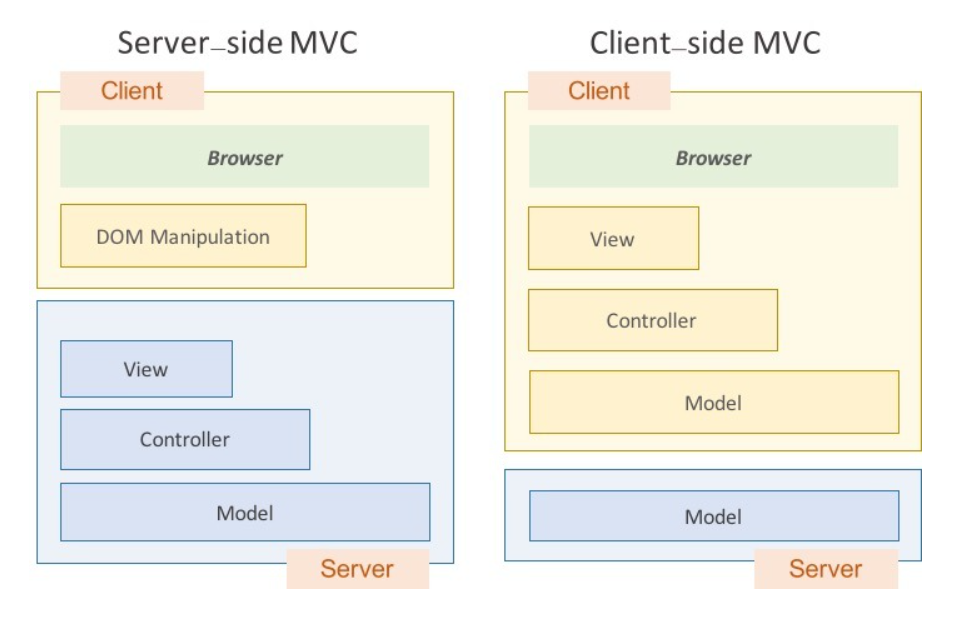
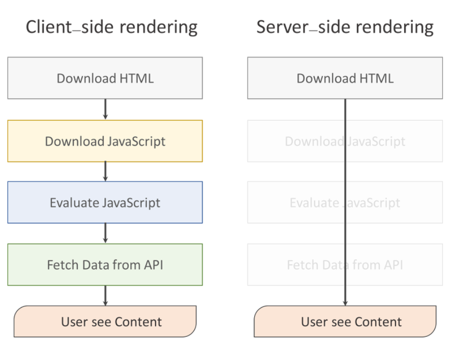

# SSR(서버 사이드 렌더링) vs CSR(클라이언트 사이드 렌더링)

모바일 시대가 도래하면서 데스크탑에 비해 성능이 낮은 모바일, 스마트폰을 통해 웹 페이지를 출력하기 위해 Single Page Web Applicaation 기법 (SPA) 이 등장하게 되었다.

SPA는 브라우저에 로드되고 난 뒤에 페이지 전체를 서버에 요청하는 것이 아니라 최초 한번 페이지 전체를 로딩한 이후 부터는 데이터만 변경하여 사용할 수 있는 웹 애플리케이션을 의미함.

SPA는 트래픽을 감소시키고 사용자에게 더 나은 경험을 제공했다. 서버는 단지 JSON 파일만 보내주는 역할을 했고, thml을 그리는 역할은 클라이언트 측에서 자바스크립트가 수행하게 된 것이다. 바로 이것이 __클라이언트 사이드 렌더링 (Client-side rendering)__ 이다.

Angular JS 와 Backbone JS 같은 Single Page를 생성하기 쉬운 JS 프레임워크들이 등장했고 특히 AngularJS 는 러닝커브를 제외한 많은 장점들 때문에 개발자들에게 큰 호응을 얻었다.(하지만 AngularJS는 느리다)

클라이언트 쪽이 점점 무거워지자 이에 반대로 View만 관리하자는 철학으로 React가 등장하게 되었다. 이렇게 클라이언트 사이드 렌더링과 서버 사이드 렌더링의 자리 싸움이 시작됨.

### 각 렌더링의 장단점

- 클라이언트 사이드 렌더링 
  - 사용자의 행동에 따라 필요한 부분만 다시 읽어들이기 때문에 서버 측에서 렌더링하여 전체 페이지를 다시 읽어들이는 것보다 빠른 인터랙션 기대할 수 있음.
  - 서버 사이드 렌더링을 한다 하더라도 Ajax 기능을 위해 클라이언트 렌더링 요소가 포함될 수 밖에 없다.
  - 단점 : 초기 구동 속도가 느리다!! but, 초기 구동 속도를 제외하면 그 다음부터는 빠름!
  - 검색 엔진 최적화의 문제가 존재한다. 추가적으로 보안문제가 발생!

# CSS Methodology

### SMACSS(Scalable and Modular Architecture for CSS)

`SMACSS`의 핵심은 범주화이며 (`categorization`) 스타일을 다섯 가지 유형으로 분류하고, 각 유형에 맞는 선택자(selector) 와 작명법 (naming convention) 을 제시한다.

- 기초(Base)
  - element 스타일의 default 값을 지정해주는 것이다. 선택자로는 요소 선택자를 사용
- 레이아웃 (Layout)
  - 구성하고자 하는 페이지를 컴포넌트를 나누고 어떻게 위치해야하는지를 결정. `id`는 CSS 에서 클래스와 성능 차이가 없는데, CSS 에서 사용하게 되면 재사용성이 떨어지기 때문에 주로 클래스를 사용
- 모듈 (Module)
  - 레이아웃 요소 안에 들어가는 더 작은 부분들에 대한 스타일을 정의한다. 클래스 선택자를 사용하며 요소 선택자는 가급적 피한다. 클래스 이름은 적용되는 스타일의 내용을 담는다.
- 상태 (States)
  - 다른 스타일에 덧붙이거나 덮어씌워서 상태를 나타냄. 그렇기 때문에 자바스크립트에 의존하는 스탕리이 된다. `is-` prefix를 붙여 상태를 제어하는 스타일임을 나타낸다. 특정 모듈에 한정된 상태는 모듈 이름도 이름에 포함
- 테마 (Theme)
  - 테마는 프로젝트에서 잘 사용되지 않는 카테코리이다. 사용자의 설정에 따라서 css 를 변경할 수 있는 css 를 설정할 때 사용하게 되며 접두어로는 `theme-`를 붙여 표시함.

### OOCSS (Object Oriented CSS)

객체지향 CSS 방법론으로 2 가지 기본원칙을 갖고 있다.

- 원칙 1 . 구조와 모양을 분리한다.
  - 반복적인 시각적 기능을 별도의 스킨으로 정의하여 다양한 객체와 혼합해 중복코드를 없앰
- 원칙 2. 컨테이너와 컨텐츠를 분리한다.
  - 스타일을 정의할 때 위치에 의존적인 스타일을 사용하지 않는다. 사물의 모양은 어디에 위치하든지 동일하게 보여야 함

### BEM (Block Element Modifier)

웹 페이지를 각각의 컴포넌트의 조합으로 바라보고 접근한 방법론이자 규칙(Rule)이다. SMACSS 가 가이드 라인이라는 것에 비해서 좀 더 범위가 좁은 반면 강제성 측면에서 다소 강하다고 볼 수 있음.

BEM 은 CSS 로 스타일을 입힐 때 id 를 사용하는 것을 막는다. 또한 요소 셀렉터를 통해서 직접 스타일을 적용하는 것도 불허한다. 하나를 더 불허 하는데 그것은 바로 자손 선택자 사용이다. 이러한 규칙들은 재사용성을 높이기 위함임

- Naming Convention
  - 소문자와 숫자만을 이용해 작명하고 여러 단어의 조합은 하이픈(`-`)과 언더바 (`_`)를 사용하여 연결
- BEM 의 B 는 "Block" 이다.
  - 블록이란 재사용 할 수 있는 독립적인 페이지 구성 요소를 말하며, HTML 에서 블록은 class 로 표시된다. 블록은 주변 환경에 영향을 받지 않아야 하며, 여백이나 위치를 설정하면 안된다.
- BEM 의 E 는 "Element" 이다.
  - 블록 안에서 특정 기능을 담당하는 부분으로 block_element 형태로 사용. 요소는 충접해서 작성 가능
- BEM 의 M 은 "Modifier" 이다.
  - 블록이나 요소의 모양, 상태를 정의. `block_element-modifier`, `block-modifier`형태로 사용한다. 수식어에는 불리언 타입과 키-값 타입이 있다.

#### Reference

- [CSS 방법론에 대해서](http://wit.nts-corp.com/2015/04/16/3538)
- [CSS 방법론 SMACSS 에 대해 알아보자](https://brunch.co.kr/@larklark/1)
- [BEM 에 대해서](https://en.bem.info/)
