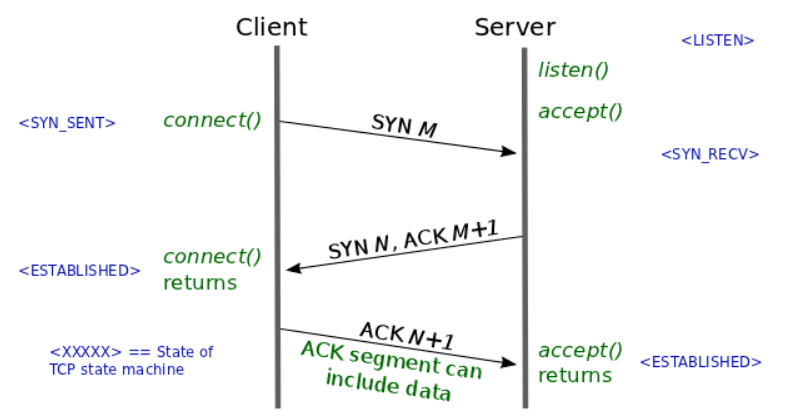
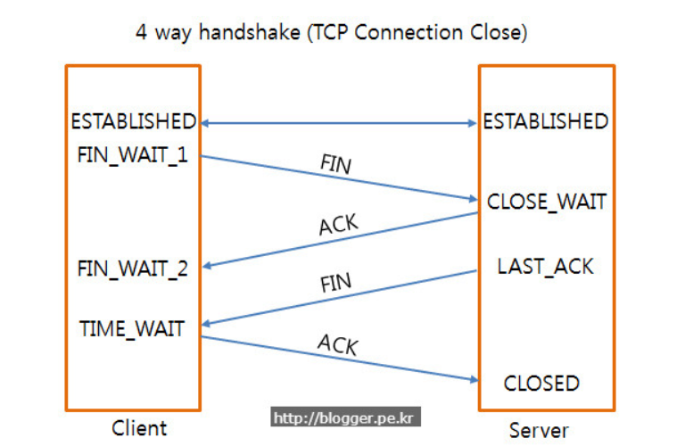

# HTTP의 GET과 POST 비교

### GET

우선 GET 방식은 요청하는 데이터가 `HTTP Request Message`의 Header 부분에 url이 담겨서 전송됨. 이 때문에 url 상에 `?`뒤에 데이터가 붙어 request를 보내게 되는 것이다. 이러한 방식은 url 이라는 공간에 담겨가기 때문에 전송할 수 있는 데이터의 크기가 제한적이다. 또 보안이 필요한 데이터에 대해서는 데이터가 그대로 url에 노출되므로 `GET` 방식은 적절하지 않다. ex) password

GET은 서버에서 어떤 데이터를 가져와서 보여준다거나 하는 용도이지 서버의 값이나 상태등을 변경하진 않음

### POST

POST 방식의 request는 `HTTP Request Message`의 Body 부분에 데이터가 담겨서 전송됨. 이 때문에 바이너리 데이터를 요청하는 경우 POST 방식으로 보내야 하는 것처럼 데이터 크기가 GET 방식보다 크고 보안면에서 낫다. (암호화를 하지 않으면 고만고만함)

POST는 서버의 값이나 상태를 변경하기 위해서 또는 추가하기 위해서 사용됨.

# TCP 3-way Handshake

연결 성립(Connection Establishment)

1) 클라이언트는 서버에 접속을 요청하는 __SYN(a)__ 패킷을 보낸다.
2) 서버는 클라이언트의 요청인 __SYN(a)__을 받고 클라이언트에게 요청을 수락한다는 __ACK(a+1)__와 __SYN(b)__이 설정된 패킷을 발송한다.
3) 클라이언트는 서버의 수락 응답인 __ACK(a+1)__와 __SYN(b)__패킷을 받고 __ACK(b+1)__를 서버로 보냄녀 연결이 __성립(establish)__된다.

연결 해제(Connection Termination)

1) 클라이언트가 연결을 종료해야겠다는 __FIN플래그__를 전송한다.
2) 서버는 클라이언트의 요청__(FIN)__을 받고 알겠다는 확인 메세지로 __ACK__를 보낸다.

   2-1. 그리고 나서는 데이터를 모두 보낼 때까지 잠깐 __TIME_OUT__이 된다.

3) 데이터를 모두 보내고 통신이 끝났으면 연결이 종료되었다고 클라이언트에게 __FIN플래그__를 전송한다.
4) 클라이언트는 __FIN 메세지__를 확인했다는 __메세지(ACK)__를 보낸다.
5) 클라이언트의 __ACK 메세지__를 받은 서버는 소켓 __연결을 close__한다.
6) 클라이언트는 아직 서버로부터 받지 못한 데이터가 있을 것을 대비해 일정 시간 동안 세션을 남겨놓고 잉여 패킷을 기다리는 과정을 거친다.__(TIME_WAIT)__

SYN Packet ? ACK Packet?

SYN : synchronize sequence number

ACK : acknowledgement

__TCP Header__에는 __Code Bit(Flag bit)__ 라는 부분이 존재한다. 이 부분은 총 __6Bit__로 이루어져 있으며 각각 한 bit들이 의미를 갖고 있다. __Urg-Ack-Psh-Rst-Syn-Fin__ 순서로 되어 있으며 해당 위치의 비트가 1이면 해당 패킷이 어떠한 내용을 담고 잇는 패킷인지를 나타낸다. SYN 패킷일 경우엔 000010이 되고 ACK 패킷일 경우에는 010000이 되는 것이다.

Why 3-way ? Is not enough 2-way?

클라이언트에게 서버에게 존재를 알리고 패킷을 보낼 수 있다는 것을 알리듯, 서버에서도 클라이언트에게 존재를 알리고 패킷을 보낼 수 있다는 신호를 보내야 한다. 그렇기 때문에 2-way-handshake로는 부족하다.

Why randomized sequence number?

처음 클라이언트에서 SYN 패킷을 보낼 때 Sequence Number 에는 랜덤한 숫자가 담겨진다. 초기 sequence number 를 ISN 이라고 한다. ISN 이 0부터 시작하지 않고 난수를 생성해서 number를 설정하는 이유는 무엇인가?

Connection을 맺을 때 사용하는 포트(port)는 유한 범위 내에서 사용하고 시간이 지남에 따라 재사용된다. 따라서 두 통신 호스트가 과거에 사용된 포트 번호 쌍을 사용하는 가능성이 존재하낟. 서버 측에서는 패킷의 SYN을 보고 패킷을 구분하게 되는데 난수가 아닌 순차적인 number가 전송된다면 이전의 connection으로부터 오는 패킷으로 인식할 수 있다. 이러한 문제가 ㅂ라생할 가능성을 줄이기 위해서 난수로 ISN을 설정하는 것이다.
