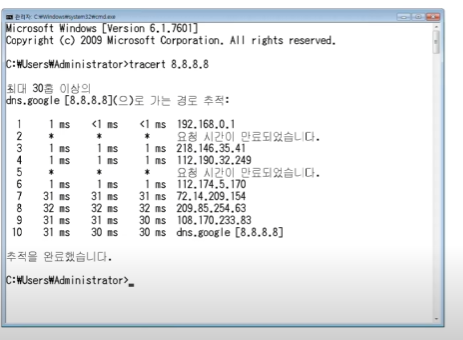
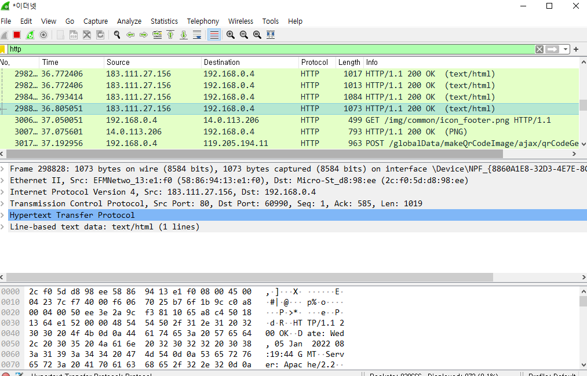
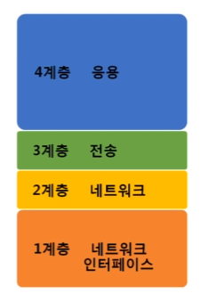
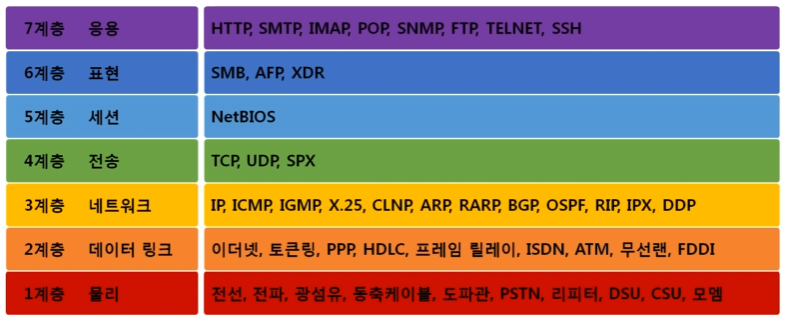
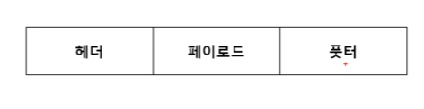
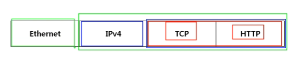
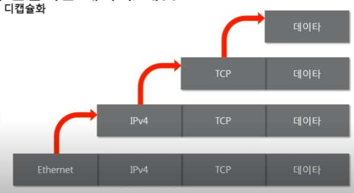
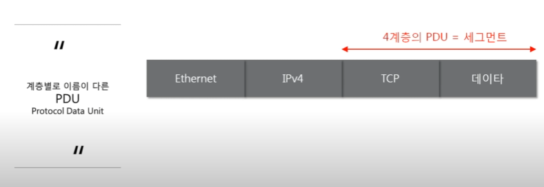

전체영상: [네트워크 기초(개정판)](https://www.youtube.com/playlist?list=PL0d8NnikouEWcF1jJueLdjRIC4HsUlULi)

### [네트워크란?](https://youtu.be/Av9UFzl_wis?list=PL0d8NnikouEWcF1jJueLdjRIC4HsUlULi)

- 네트워크 : **노드**들이 데이터를 공유할 수 있게 하는 디지털 전기통신망의 하나이다.
- 인터넷 : 문서, 그림 영상과같은 여러가지 데이터를 공유하도록 구성된 세상에서 가장 큰 **네트워크**
- 네트워크의 분류
  - 크기에 따른 분류 
    - LAN(Local Area Newwork)
    - WAN(Wide Area Network) : 멀리 있는 지역을 한데 묶은 네트워크, LAN과 LAN을 하나로 묶은 것
    - MAN
    - VLAN, CAN, PAN
  - 연결 형태에 따른 분류
    - Star 형 : 중앙 장비에 모든 노드가 연결 // ex) 공유기
    - Mesh형 : 여러 노드들이 서로 그물처럼 연결 
    - Tree형
    - 링형, 버스형, 혼합형 등등 => 혼합형 : 실제 인터넷은 여러 형태를 혼합한 형태
- 네트워크의 통신방식
  - 유니 캐스트 : 특정 대상이랑만 1:1로 통신
  - 멀티 캐스트 : 특정 다수와 1:N으로 통신
  - 브로드 캐스트 : 네트워크에 있는 모든 대상과 통신
- 네트워크 프로토콜
  - 프로토콜 : 네트워크에서 노드와 노드가 통신할때 **어떤 노드**가 **어느 노드**에게 **어떤 데이터**를 **어떻게** 보내는지 작성하기위한 양식
- 패킷 : 여러 프로토콜들로 캡슐화 됨

### [실습1 (tracert)](https://youtu.be/paJf7JbBWqY?list=PL0d8NnikouEWcF1jJueLdjRIC4HsUlULi)

- 구글과 나는 어떻게 연결되어 있는지 확인

### [실습2 (Wireshark)](https://youtu.be/vBrQ3yzerMg?list=PL0d8NnikouEWcF1jJueLdjRIC4HsUlULi)

- 네트워크를 통해 데이터 통신되는 과정

### [네트워크 모델](https://youtu.be/y9nlT52SAcg?list=PL0d8NnikouEWcF1jJueLdjRIC4HsUlULi)

- TCP/IP 모델

  - **1계층** 네트워크 인터페이스 => 2계층 네트워크 => **3계층** 전송 => **4계층** 응용

    

- OSI 7계층

  - **1계층** 물리 

  - **2계층** 데이터링크 : 이더넷

  - **3계층** 네트워크 : IP, ICMP, ARP

  -  **4계층** 전송 : TCP, UDP

  - **5계층** 세션

  - **6계층** 표현

  - **7계층** 응용 : HTTP(웹통신)

    

- TCP/IP 모델 vs OSI 7 계층 (TCP/IP는 실무적느낌, OSI는 논리적 느낌)
  - 공통점
    - 계층적 네트워크 모델
    - 계층간 역할 정의
  - 차이점
    - 계층의 수 차이
    - OSI는 역할기반, TCP/IP는 프로토콜 기반
    - OSI 는 통신 전반에 대한 표준, TCP/IP 는 데이터 전송기술 특화

- 패킷 : 네트워크를 통해 전달되는 데이터, 제어 정보와 사용자 데이터로 이루어지며 사용자 데이터는 페이로드라고도함

  

- 캡슐화 : 패킷을 만드는 과정

  TCP(헤더) + HTTP (페이로드)

  IPv4(헤더) + (TCP + HTTP) (페이로드) 

  Ethernet(헤더) + (IPv4 + TCP + HTTP) (페이로드)

앞에 계층은 같거나 하위계층만 붙을 수 있음!! 

위 그림에서 TCP 4계층 앞에 IPv4 3계층 앞에 Ethernet 2계층으로 붙을수 있음 아니면 TCP 앞에 TCP 앞에 IPv4 이런식으로 붙을 수 있음

- 디캡슐화 : 데이터를 확인하는 과정

- PDU

3계층 = 패킷

2계층 = 프레임

일반적인 패킷은 3계층보단 데이터들 자체를 부름

