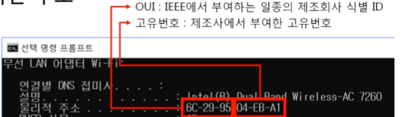
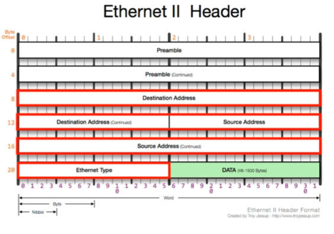

영상: [[따라學IT] 03. 가까이 있는 컴퓨터끼리는 이렇게 데이터를 주고받는다](https://youtu.be/HkiOygWMARs?list=PL0d8NnikouEWcF1jJueLdjRIC4HsUlULi)

### 2계층에서 하는일

- 하나의 네트워크 대역, 즉 같은 네트워크 상에 존재하는 여러 장비들 중에서 어떤 장비가 어떤 장비에게 보내는 데이터를 전달

- 오류제어 및 흐름제어 수행

- **2계층의 네트워크 크기**

  - 하나의 네트워크 대역 LAN 에서만 통신할 때 사용
  - 다른 네트워크와 통신할 때에는 항상 3계층이 도와줘야함

- MAC 주소 : LAN에서 통신할 때 사용, 아래그림에서 물리적 주소

  

  

### 2계층(Ethernet) 프로토콜

위 사진에서 DATA 는 payload , Destination Address 부터 Ethernet Type 까지 Ethernet 프로토콜 구조

Ethernet Tpye은 다음 3계층 미리 알려주는 역할 => 미리 알 수 있으면 분석하기 쉬워짐

- 2계층 프로토콜
  - Ethernet : 14 바이트
    - 목적지 주소 : 데이터를 전달받을 상대방의 시스템의 MAC 주소 6바이트
    - 출발지 주소 : 데이터를 전달하는 시스템의 MAC 주소 6바이트
    - 상위 프로토콜 타입 : 2바이트 , ex) IPv4 (0x0800) , ARP (0x0806)